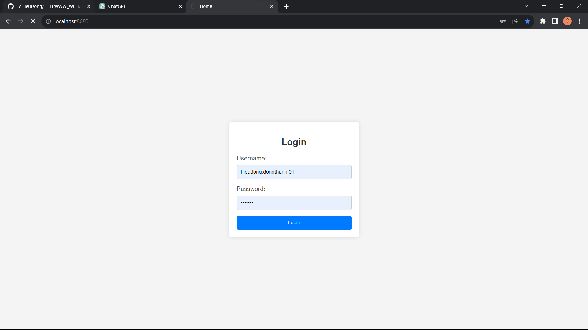
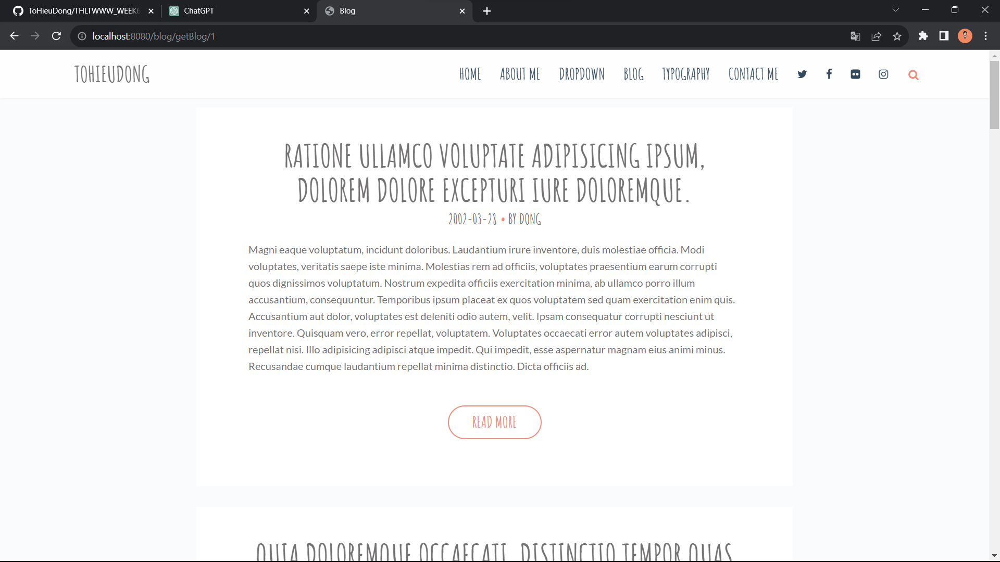
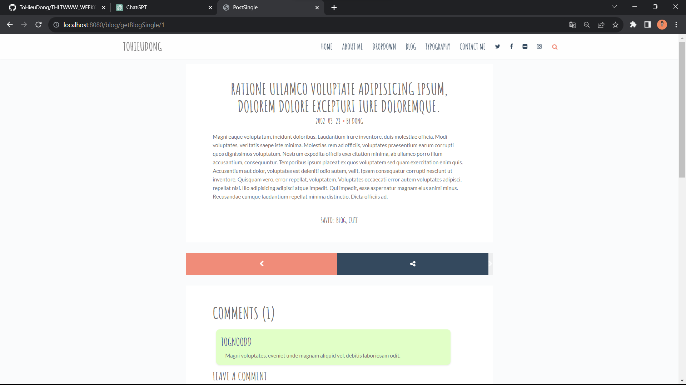

# THLTWWW_WEEK6
Bài tập tuần 6

## Yếu cầu:
Create web pages that act like a blog web site.

-  [(Link template:)](https://themewagon.com/themes/free-html5-personal-blog-template-itsy/)
-  [(Link Controller:)](https://github.com/ToHieuDong/THLTWWW_WEEK6/blob/master/src/main/java/com/example/week6/frontend/BlogController.java)

- [Đăng nhập bằng tài khoản của 1 user](https://github.com/ToHieuDong/THLTWWW_WEEK6/blob/master/src/main/resources/templates/index.html)
- 
- [Load các bài Post của cá nhân User 1](https://github.com/ToHieuDong/THLTWWW_WEEK6/blob/master/src/main/resources/templates/home.html)
- 
- [Hiện chi tiết bài post đã chọn và hiện các comment của bài post đó](https://github.com/ToHieuDong/THLTWWW_WEEK6/blob/master/src/main/resources/templates/single.html)
- 
